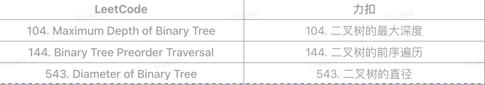

# 2、树
* 二叉树
* 多叉树
## 2.1、树的遍历
## 2.2、广度优先遍历
> ⼴度优先遍历是从⼆叉树的第⼀层（根结点）开始，⾃上⾄下逐层遍历；在同⼀层中，按照从左到右的顺序对结点逐⼀访问。
```js
/**
 * * 广度优先遍历
 * @param root
 */
// 广度优先遍历，写法 1：层序遍历，用队列先进先出
// 区别：可以在循环中获取节点是属于哪一层的
// 时间复杂度是 O(n)，每个节点访问切只访问一次，所以是 O(n)
function bfs1(root: BinaryTree) {
  const queue = new Array<BinaryTree>();
  queue.push(root);
  let level = 1;

  while (queue.length) {
    const sz = queue.length;
    console.log("llllll-1", level);
    level++;
    for (let index = 0; index < sz; index++) {
      // ts中“!”非空断言不可能是空
      const curr = queue.shift()!;
      console.log("curr", curr.value);
      if (curr.left) queue.push(curr.left);
      if (curr.right) queue.push(curr.right);
    }
  }
}

// 广度优先遍历，写法 2：层序遍历，用队列先进先出
// 区别：无法在循环中获取节点是属于哪一层的
// 时间复杂度是 O(n)，每个节点访问切只访问一次，所以是 O(n)
function bfs2(root: BinaryTree) {
  const queue = new Array<BinaryTree>();
  queue.push(root);
  let level = 1;

  while (queue.length) {
    console.log("llllll-2", level);
    level++;

    // ts中“!”非空断言不可能是空
    const curr = queue.shift()!;
    console.log("curr2", curr.value);
    if (curr.left) queue.push(curr.left);
    if (curr.right) queue.push(curr.right);
  }
}
```
## 2.3、深度优先遍历（递归遍历）
> D：访问根结点，L：遍历根结点的左子树，R：遍历根结点的右子树。
> * 先序遍历：DLR
> * 中序遍历：LDR
> * 后序遍历：LRD
```js
function traverse(root?: TreeNode) {
    if (!root) return
    // 前序位置
    traverse(root.left)
    // 中序位置
    traverse(root.right)
    // 后序位置
}
```

* 前序： 1 2 3 4 5 6 7
* 中序： 3 2 4 1 7 6 5
* 后序： 3 4 2 7 6 5 1

> Why 后序遍历更好用?
> * 前序位置的代码执行是自顶向下的，而后序位置的代码执行是自底向上的
> * 一旦你发现题目和子树有关，那大概率要给函数设置合理的定义和返回值，在后序位置写代码了。
> * 前序位置的代码只能从函数参数中获取父节点传递来的数据，而后序位置的代码不仅可以获取参数数据，还可以获取到子树通过函数返回值传递回来的数据。
## 2.4、相关题目



