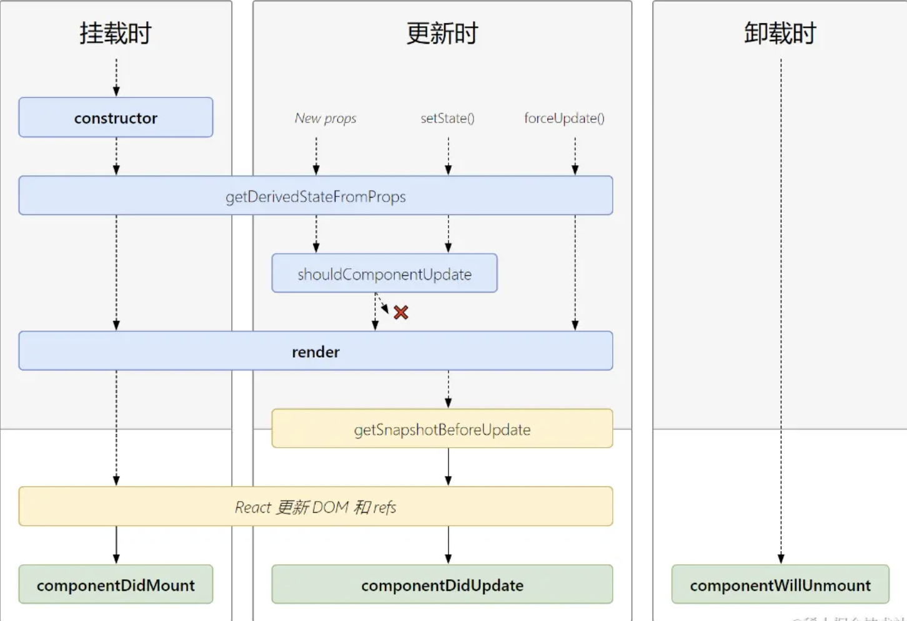

# 1、react 高级

## 1.1、生命周期



> 为什么废弃 react 生命周期函数：https://segmentfault.com/a/1190000021272657

### 1.1.1、类组件

- 初始化：由 ReactDOM.render()触发---初次渲染
  - constructor
  - getDerivedStateFromProps
  - componentWillMount
  - Render
  - componentDidMount
- 更新阶段：由组件内部 setSate()或父组件重新 render 触发
  - getDerivedStateFromProps
  - shouldComponentUpdate
  - Render
  - getSnapshotBeforeUpdate
  - componentDidUpdate
- 销毁阶段：由 ReactDOM.unmountComponentAtNode()触发
  - componentWillUnmount

```jsx
import React, { Component } from "react";

class LifecycleComponent extends Component {
  constructor(props) {
    super(props);
    console.log("Constructor called");
  }

  componentDidMount() {
    console.log("Component did mount");
  }

  componentDidUpdate(prevProps, prevState) {
    console.log("Component did update");
  }

  componentWillUnmount() {
    console.log("Component will unmount");
  }

  render() {
    console.log("Render called");
    return <div>Lifecycle Component</div>;
  }
}

export default LifecycleComponent;
```

### 1.1.2、函数组件

- useEffect
  `useEffect(() => destory, deps)` - () => destory：第一个参数，是一个函数； - destory：作为 callback 的返回值，在下一次 callback 执行之前调用，用于清除上一次 callback 的副作用； - deps：依赖数组，如果数组中的数据发生改变，则执行上一次的 callback 的 destory 函数，再执行 callback 函数；
- useLayoutEffect - 同步执行； - useEffect 在浏览器界面绘制了以后执行。 - useLayoutEffect 是在 dom 更新完成后，浏览器渲染前；
  > 修改 DOM，改变布局就用 useLayoutEffect， 其他就用 useEffect

```js
import React, { useEffect } from "react";

const FunctionComponent = () => {
  useEffect(() => {
    console.log("Component did mount");

    return () => {
      console.log("Component will unmount");
    };
  }, []);

  useEffect(() => {
    console.log(
      "类似于：componentWillReceiveProps，其实就是监听数据变化而做动作，更新组件"
    );
  }, [props]);

  useEffect(() => {
    console.log("Component did update");
  });

  useLayoutEffect(() => {
    console.log("Component did update -- layout");
  });

  console.log("Render called");

  return <div>Function Component</div>;
};

export default FunctionComponent;
```

## 1.2、hook

### 1.2.1、reducer

```jsx
import React, { useReducer, useState } from "react";

const initialState = { count: 0 };

// 用来定义当 action 是什么样的时候，我的 state 应该怎么变化
function reducer(state, action) {
  switch (action.type) {
    case "increment":
      return { count: state.count + 1 };
    case "decrement":
      return { count: state.count - 1 };
    case "reset":
      return { count: 0 };
    default:
      console.log(`Unhandled action type: ${action.type}`);
      return state;
  }
}

function Reducer() {
  const [number, setNumber] = useState(0);
  // 问题在于，number 在实际使用时，可以是 任意值，而不是 0 或 1。这样就会导致，有一些运算或者其他类型限制时，我非常不安全
  // 使用 useReducer 进行状态管理，可以解决这个问题。

  // reducer 让我的数据变得可预测。
  const [state, dispatch] = useReducer(reducer, initialState);

  return (
    <div>
      <h2>useReducer</h2>
      {number}--{state.count}
      <button onClick={() => dispatch({ type: "increment" })}>+</button>
      <button onClick={() => dispatch({ type: "decrement" })}>-</button>
      <button onClick={() => dispatch({ type: "reset" })}>reset</button>
    </div>
  );
}

export default Reducer;
```

### 1.2.2、ref

#### 1.2.2.1、类组件

```jsx
import React, { Component, createRef } from "react";

export default class ClassRef extends Component {
  constructor(props) {
    super(props);
    this.eleRef = createRef();
    this.inputRef = createRef();
  }

  handleClick = () => {
    // 我们点一下这个按钮，我们希望，我们的光标可以命中 input
    this.inputRef.current.focus();
    console.log(this.eleRef.current);
  };

  render() {
    return (
      <div>
        <div id="usingRef" ref={this.eleRef}></div>
        <input ref={this.inputRef} />
        <button onClick={this.handleClick}>focus</button>
      </div>
    );
  }
}
```

#### 1.2.2.1、函数组件

```jsx
import React, { useRef } from "react";

function Ref() {
  const inputRef = useRef(null);
  return (
    <div>
      <input ref={inputRef} />
      <button onClick={() => inputRef.current.focus()}>focus</button>
    </div>
  );
}

export default Ref;
```

#### 1.2.2.1、ref 常见的使用方式

- 可以直接控制到子组件的一些方法的调用

```jsx
import React, {
  forwardRef,
  useImperativeHandle,
  useRef,
  useState,
} from "react";

function VisibleAPI() {
  const modalRef = useRef(null);

  return (
    <div>
      <h2>页面外面的逻辑</h2>
      <button onClick={() => modalRef.current.setVisible(true)}>显示</button>
      <button>隐藏</button>
      <FancyModal ref={modalRef} />
    </div>
  );
}

const MyModal = (props, ref) => {
  const [vis, setVis] = useState(false);

  const setVisible = (val) => {
    setVis(val);
  };

  // 我们要把我们的方法，包装成一个对象，给用ref 转发出去。
  useImperativeHandle(ref, () => ({
    setVisible,
  }));

  return (
    <div
      style={{
        display: vis ? "block" : "none",
        position: "relative",
        height: "200px",
        background: "#ddeecc",
      }}
    >
      <button
        style={{ position: "absolute", right: "10px", top: "10px" }}
        onClick={() => setVis(false)}
      >
        X
      </button>
      <div>我是一个模拟弹窗</div>
    </div>
  );
};

const FancyModal = forwardRef(MyModal);

export default VisibleAPI;
```

### 1.2.3、context

#### 1.2.3.1、类用法

ThemeContext

```jsx
import { createContext } from "react";

export const ThemeContext = createContext("light");
```

ClassContext

```jsx
import React, { Component } from "react";
import { ThemeContext } from "./ThemeContext";

const store = {};

export default class ClassContext extends Component {
  constructor(props) {
    super(props);
    this.state = {
      theme: "light",
    };
  }

  render() {
    return (
      <ThemeContext.Provider value={this.state.theme}>
        <Parent />
        <button onClick={() => this.setState({ theme: "light" })}>light</button>
        <button onClick={() => this.setState({ theme: "dark" })}>dark</button>
      </ThemeContext.Provider>
    );
  }
}

const Parent = () => (
  <div>
    <Child1 />
    <Child2 />
  </div>
);

class Child1 extends Component {
  // 方法1. 通过静态变量拿
  static contextType = ThemeContext;
  render() {
    return <div>child1 -- {this.context}</div>;
  }
}

class Child2 extends Component {
  // 方法2. Consumer
  render() {
    return (
      <ThemeContext.Consumer>
        {(theme) => <div>child2 -- {theme}</div>}
      </ThemeContext.Consumer>
    );
  }
}
```

#### 1.2.3.2、函数用法

```jsx
import React, { createContext, useContext } from "react";

export const NavContext = createContext(null);
const history = window.history;

function FuncContext() {
  return (
    <NavContext.Provider value={history}>
      <Parent />
    </NavContext.Provider>
  );
}

function Parent() {
  return (
    <div>
      <WithRouterChild />
    </div>
  );
}

const withRouter = (Component) => {
  return () => {
    const history = useContext(NavContext);
    return <Component history={history} />;
  };
};

const Child = (props) => {
  return (
    <div>
      <span>func usage</span>
      <button onClick={() => props.history.pushState({}, undefined, "hello")}>
        hello
      </button>
    </div>
  );
};

const WithRouterChild = withRouter(Child);

export default FuncContext;
```

### 1.2.4、HOC

#### 属性代理

- 正常的高阶函数用法，我给最终的 component，传入一些能力
  - 外面包一层样式；
  - 把 history 给你注入进去

```jsx
// 正常卡片包裹写法
export const Card = ({ title, children }) => {
  return (
    <div>
      <h2>{title}</h2>
      {children ? (
        <div
          style={{ border: "1px solid #ccc", padding: "12px", margin: "12px" }}
        >
          {children}
        </div>
      ) : null}
    </div>
  );
};

// 高阶组价卡片包裹写法
export const withCard = (title) => (Component) => {
  return (props) => {
    const hocStyle = {
      border: "1px solid #ccc",
      padding: "12px",
      margin: "12px",
      borderRadius: "4px",
    };

    return (
      <div style={hocStyle}>
        <h2>{title}</h2>
        <Component {...props} />
      </div>
    );
  };
};
```
