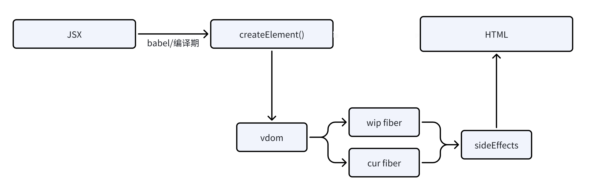

# 1、react 基础
## 1.1、react 在做什么

## 1.2、创建 react 工程
```sh
npx create-react-app demo-app
npx create-react-app demo-app -- tempalte typescript
# 暴漏 cra 创建项目时候的基本配置
npm run eject
```
## 1.3、React 的基本能力
### 1.3.1、类组件
### 1.3.2、函数组件
### 1.3.3、父子组件传值
### 1.3.4、条件渲染、列表

